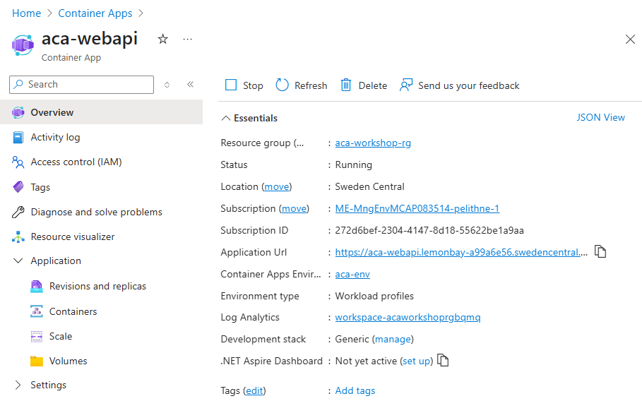
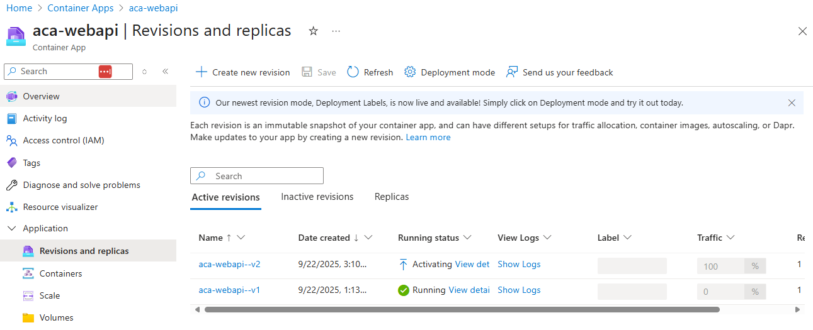
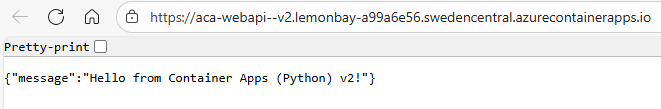

# Exercise 1: From App Service Web API to Azure Container Apps

This exercise walks you through containerizing a simple Python FastAPI web API, pushing the image to Azure Container Registry (ACR), and deploying it to Azure Container Apps (ACA) with ingress, scaling, and health probes — all using Azure CLI.

> Estimated time: 45–60 minutes

---

## Clone the Repository

If you have not already cloned this workshop repository, do that first so you have the application source (`app/`), `Dockerfile`, and exercise guides locally (or in your Cloud Shell workspace).

```bash
git clone https://github.com/pelithne/appservice-to-containerapp.git
cd appservice-to-containerapp
ls -1 app
```

If you are using Azure Cloud Shell you can paste the above directly. The `ls` command should show `main.py`, `requirements.txt`, and `Dockerfile`.

## Prerequisites

- Azure subscription with permission to create resource groups and container resources
- Azure CLI (>= 2.53) or Azure Cloud Shell (no local Docker required)
- Logged in:
  ```bash
  az login
  az account show
  ```
- (Optional) jq for nicer JSON parsing

## Environment Variables
These variables keep the rest of the commands pleasantly short. Pick a stable, but unique, `ACR_NAME` if you want to reuse the registry later (or keep `$RANDOM` for ephemeral fun).

```bash
RESOURCE_GROUP="aca-workshop-rg"
LOCATION="swedencentral"
ACR_NAME="acaworkshop$RANDOM"
APP_NAME="aca-webapi"
ENV_NAME="aca-env"
IMAGE_NAME="webapi"
IMAGE_TAG="v1"
FULL_IMAGE="${ACR_NAME}.azurecr.io/${IMAGE_NAME}:${IMAGE_TAG}"
```
Create the resource group (your blast radius boundary):
```bash
az group create -n "$RESOURCE_GROUP" -l "$LOCATION"
```

## 1. Create / Containerize a Simple Python FastAPI Web API
The application we are containerizing is veeeery simple. It's just a tiny bit of python code and it's requirements. In order to containerize we have added a simple Dockerfile.

Project layout:
```
app/
  ├── main.py
  ├── requirements.txt
  └── Dockerfile
```

Feel free to have a look at the code and the Dockerfile, to get an understanding of what it does. 


## 2. Create ACR
Provision your private container registry. We deliberately disable the legacy admin user for better security hygiene (use Azure AD auth + managed identities instead).
```bash
az acr create -n "$ACR_NAME" -g "$RESOURCE_GROUP" --sku Basic --admin-enabled false
```

## 3. Build Image with ACR (Cloud Shell Friendly)
Instead of using a local Docker engine we leverage ACR Tasks (`az acr build`). This uploads the build context and builds the image inside Azure. The build both builds AND pushes the image automatically.

```bash
az acr build \
  --registry "$ACR_NAME" \
  --image ${IMAGE_NAME}:${IMAGE_TAG} \
  ./app
```
Commentary: If the first build waits on an agent, that’s normal cold start. Subsequent builds are snappier thanks to layer caching.

Verify repository & tag:
```bash
az acr repository show-tags -n "$ACR_NAME" --repository "$IMAGE_NAME" -o table
```
Purpose: Inventory check. If nothing shows, the build failed or you queried the wrong repo name.

## 4. ACA Environment
Make sure you have the freshest `containerapp` CLI with the ````az extension add```` command below. 


````bash
az extension add --name containerapp --upgrade

````

After the command completes, create a managed environment. If it fails, it could be that the extension is not completely installed yet. If so, just try again.

````bash
az containerapp env create -n "$ENV_NAME" -g "$RESOURCE_GROUP" -l "$LOCATION"
````

## 5. Deploy App + Probes
Deploy the Container App to the newly created environment. This command will create an app with an external ingress listening on port 443, that forwards traffic to your app on port 8080. Also the app will be created with specific cpu- and memory requirements and with a max number of allowed replicas set to 5.

```bash
az containerapp create \
  -n "$APP_NAME" -g "$RESOURCE_GROUP" \
  --environment "$ENV_NAME" \
  --image "$FULL_IMAGE" \
  --ingress external --target-port 8080 \
  --registry-server "${ACR_NAME}.azurecr.io" \
  --min-replicas 1 --max-replicas 5 \
  --cpu 0.25 --memory 0.5Gi \
  --revision-suffix v1
```

When this command finishes, you can go to the Azure portal and check your **Container App**. It should look similar to the image below, and there should be an *Application Url* that you can click on to confirm that your app is up and running.




<!--
DEPRECATED PROBE INSTRUCTION (commented out):
The following guidance attempted to add probes using --set with a nested path. The Container Apps CLI interprets --set keys as env var names, so this fails with an invalid env var error.
Retained here for reference; replace with YAML-based update instructions.

Add liveness and readiness probes so Azure Container Apps can monitor and react to container health:

* Liveness probe: Restarts the container if `/healthz` stops answering (protects against deadlocks or a wedged event loop).
* Readiness probe: Keeps traffic away until the app is truly ready; later failures pause traffic without killing the process.

Tip: You can adjust `initialDelaySeconds` if startup time grows—better than watching a flurry of false negatives.

```bash
az containerapp update -n "$APP_NAME" -g "$RESOURCE_GROUP" --set template.containers[0].probes='[
  {"type":"liveness","httpGet":{"path":"/healthz","port":8080},"initialDelaySeconds":5,"periodSeconds":10},
  {"type":"readiness","httpGet":{"path":"/healthz","port":8080},"initialDelaySeconds":2,"periodSeconds":5}
]'
```
-->
## 6. Scaling
```bash
az containerapp update -n "$APP_NAME" -g "$RESOURCE_GROUP" \
  --scale-rule-name http-concurrency --scale-rule-type http \
  --scale-rule-metadata concurrentRequests=50 \
  --min-replicas 1 --max-replicas 10
```
Commentary: This adds an HTTP concurrency scale rule; think “open tables in a café.” Go higher if each request is I/O bound, lower if CPU heavy. Min keeps a warm instance; max caps runaway scaling.


## 7. New Version
Update the **message** of the python app using the ````sed```` command. Sed can be use to replace a string with another string.

```bash
sed -i 's|Hello from Container Apps (Python)!|Hello from Container Apps (Python) v2!|' app/main.py

```

Then rebuild using ACR Tasks:
````bash
az acr build --registry "$ACR_NAME" --image ${IMAGE_NAME}:v2 ./app

````

After this you can update the container app to use the new version with this command. Note that we are now using **:v2** instead of **:v1**: 

````bash
az containerapp update -n "$APP_NAME" -g "$RESOURCE_GROUP" --image ${ACR_NAME}.azurecr.io/${IMAGE_NAME}:v2 --revision-suffix v2
````


If you go to the Azure portal and look under **Revisions and replicas** you will find that a new replica is either activating like in the image below or acivated.




Navigate to your container app, and click on the **Application URL**. You should find that the message has now changed:




Now, lets pretend that we introduce an error in our application, once again using the ````sed```` command.

```bash
sed -i 's|Hello from Container Apps (Python) v2!|Error Error Error Error!!!|' app/main.py

```
Then rebuild the container. This time we tag it as version 3 (v3).
````bash
az acr build --registry "$ACR_NAME" --image ${IMAGE_NAME}:v3 ./app
````

Now update the container with the new version. But this time we are worried that we might have introduced an error, so we only want to deploy the app in a **Canary** fashion, meaning that we only want the new replica to receive a small percentage of the traffic.

First deploy the new revision (do NOT disable the previous one):
````bash
az containerapp update -n "$APP_NAME" -g "$RESOURCE_GROUP" --image ${ACR_NAME}.azurecr.io/${IMAGE_NAME}:v3 --revision-suffix v3
````

List the revisions so we know their full names:
````bash
az containerapp revision list -n "$APP_NAME" -g "$RESOURCE_GROUP" -o table
````
You should see something like (names will differ):
```
Name                         Traffic Weight  Active  Running
aca-webapi--v1               100%            true    Yes
aca-webapi--v2               0%              true    No
aca-webapi--v3               0%              true    Yes
```
We want 70% to stay on the stable revision (for example v2 if that is the current serving one) and 30% to go to our new v3 canary.

Split traffic (replace the names with those returned above):
````bash
az containerapp ingress traffic set -n "$APP_NAME" -g "$RESOURCE_GROUP" \
  --revision-weight "${APP_NAME}--v2=70" "${APP_NAME}--v3=30"
````

Verify the distribution:
````bash
az containerapp ingress traffic show -n "$APP_NAME" -g "$RESOURCE_GROUP" -o table
````

Hit the application URL several times (or use a quick loop) to observe intermittent Error responses (the canary) among the stable ones. Adjust weights as confidence grows:
````bash
az containerapp ingress traffic set -n "$APP_NAME" -g "$RESOURCE_GROUP" \
  --revision-weight "${APP_NAME}--v2=50" "${APP_NAME}--v3=50"
````

Roll back instantly by sending 100% to the previous revision:
````bash
az containerapp ingress traffic set -n "$APP_NAME" -g "$RESOURCE_GROUP" \
  --revision-weight "${APP_NAME}--v2=100"az containerapp update -n "$APP_NAME" -g "$RESOURCE_GROUP" --revisions-mode multiple
````

### (Aside) Revision naming & dynamic lookup
Container Apps composes revision names as `<app-name>--<revision-suffix>` (double dash). If you omit `--revision-suffix`, an auto‑generated hash style suffix is used. Using explicit suffixes (v1, v2, v3) makes traffic commands readable.

If you ever forget the exact names, list them:
```bash
az containerapp revision list -n "$APP_NAME" -g "$RESOURCE_GROUP" -o table
```

You can also script grabbing the current “stable” revision (highest weight) then applying a canary automatically:
```bash
STABLE=$(az containerapp ingress traffic show -n "$APP_NAME" -g "$RESOURCE_GROUP" \
  --query "[?weight==`70`].revisionName" -o tsv)
NEW=$(az containerapp revision list -n "$APP_NAME" -g "$RESOURCE_GROUP" \
  --query "[?contains(name, 'v3')].name" -o tsv)
echo "Stable=$STABLE New=$NEW"
az containerapp ingress traffic set -n "$APP_NAME" -g "$RESOURCE_GROUP" \
  --revision-weight "$STABLE=70" "$NEW=30"
```

Adjust the 70 to whatever your current stable percentage is (or query for the max weight instead of a literal).


## 8. Logs
```bash
az containerapp logs show -n "$APP_NAME" -g "$RESOURCE_GROUP" --follow
```
Tip: Add `--tail 100` or pipe through `grep` for targeted hunts. For structured querying, consider attaching Log Analytics (next exercises / future enhancement).


## 9. Cleanup
```bash
az group delete -n "$RESOURCE_GROUP" --yes --no-wait
```
Retires everything in one swing. Omit `--no-wait` if you want synchronous confirmation. Double‑check the RG name—undo is… not a thing.
<!-- END ORIGINAL CONTENT -->
